# Cognigy Webchat Theme Builder


A single-page tool for visually customizing the look of a Cognigy webchat widget and exporting either a copy/paste-ready CSS snippet or a portable JSON theme.

Edit colors, gradients, typography, shape, borders, shadows, hover states, and header alignment with live controls. Preview the widget in real time, optionally test it against a real Cognigy endpoint in a sandboxed live preview, then export a Cognigy-compatible stylesheet (with both light and dark mode rules) - or download the entire preview as a self-contained HTML file you can share with clients.

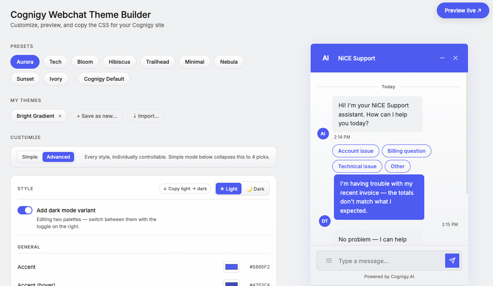

## What's in v1.0

- **10 presets** including a new **Cognigy Default** that mimics the stock widget for clean starting points.
- **Live CSS + JSON export** - switch tabs, copy either format, round-trip themes between teammates.
- **Live Cognigy preview** - load your real endpoint into a sandboxed iframe with your theme applied. **Download** the result as a self-contained HTML file to share with clients.
- **Light + dark mode editing** - opt-in dark palette, smart luminance inversion via "Copy light → dark".
- **Simple mode** - four picks (primary, surface, bubble style, shape) derive ~20 styles.
- **Organized control panel** - General, Window, Header, Chat Bubbles, Input Field, and Toggle subsections.
- **Responsive sizing** - exported CSS clamps width/height via `min()` so the widget stays usable on mobile.
- **v2 + v3 compatible** - selectors target both Cognigy webchat class generations in the same snippet.

## Quick start

It's a single static HTML file - no build step, no dependencies.

```sh
open index.html
```

Or serve it from any static host. That's the whole setup.

## How to use it

1. **Pick a preset** from the chip row. Pick **Cognigy Default** at the end of the row for a neutral baseline that mimics Cognigy's stock widget appearance - useful when starting from scratch.
2. **Pick a mode** - Simple (four high-level choices that derive ~20 styles) or Advanced (every style individually controllable).
3. **Adjust controls** - colors via picker, gradients via two-stop builder, radii and font sizes via slider, widget dimensions via slider. The preview on the right and the export output update instantly.
4. **Click any element in the preview** to jump straight to its style control.
5. **(Optional) Add a dark mode variant** with one toggle. Need to convert your light theme to dark? Hit "↓ Copy light → dark" and it auto-darkens via luminance inversion in one click.
6. **Switch between CSS and JSON** in the Export panel. The CSS is what you paste into Cognigy; the JSON is what you'd save or share with a teammate.
7. **Pick an output mode** for the CSS snippet (Light only, Dark only, or Both - only relevant when dark mode is enabled).
8. **Copy** the snippet and paste it into your Cognigy webchat custom CSS field - or paste your endpoint URL into the **Preview live ↗** modal to see it on a real widget first, and optionally download a self-contained HTML demo to share.

Your in-progress theme is autosaved to `localStorage`, so a refresh won't lose your work. **Reset** clears storage and reloads the Aurora preset.

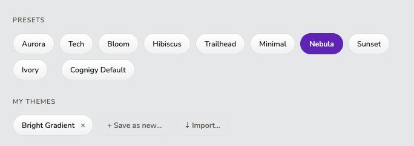

## Features

### Live export - CSS or JSON

Every change updates the export output in real time. Two tabs control what's emitted:

- **CSS tab** - the generated stylesheet to paste into Cognigy's custom CSS field. Light/Dark/Both filter applies here.
- **JSON tab** - the entire theme as a portable JSON object (`{ version, name, light, dark? }`), ready to import elsewhere or hand to a teammate.

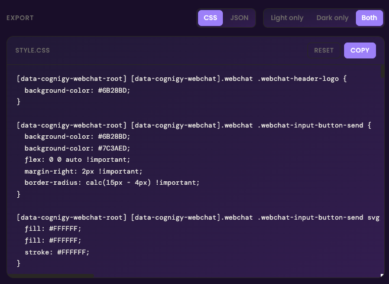

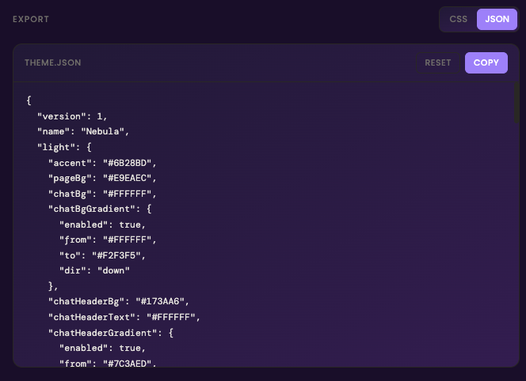

The CSS snippet emits **per-class rules** wrapped in the Cognigy specificity selectors - not CSS variable assignments - because the Cognigy webchat's internal stylesheet doesn't reference these styles by name. Example:

```css
[data-cognigy-webchat-root] [data-cognigy-webchat].webchat .webchat-header-bar {
  background-color: #1C1B18;
}

@media (prefers-color-scheme: dark) {
  [data-cognigy-webchat-root] [data-cognigy-webchat].webchat .webchat-header-bar {
    background-color: #111110;
  }
}
```

When "Both" output mode is selected, dark mode is delivered via `@media (prefers-color-scheme: dark)` - **no JavaScript is required** on the host site. The browser switches automatically based on the user's OS preference.

Selectors are emitted with both v2 (`.regular-message`) and v3 (`.chat-bubble`) class names, so the same generated CSS works on any Cognigy webchat version.

### Light + dark mode editing

Dark mode is opt-in. Toggle "Add dark mode variant" on, and a second palette becomes editable. Switch between Light and Dark with the segmented control. Typography, shape, and sizing automatically mirror across both modes - only colors diverge.

The "↓ Copy light → dark" button takes your light palette and intelligently inverts luminance on backgrounds and text while preserving accent colors, giving you a usable dark theme in one click.

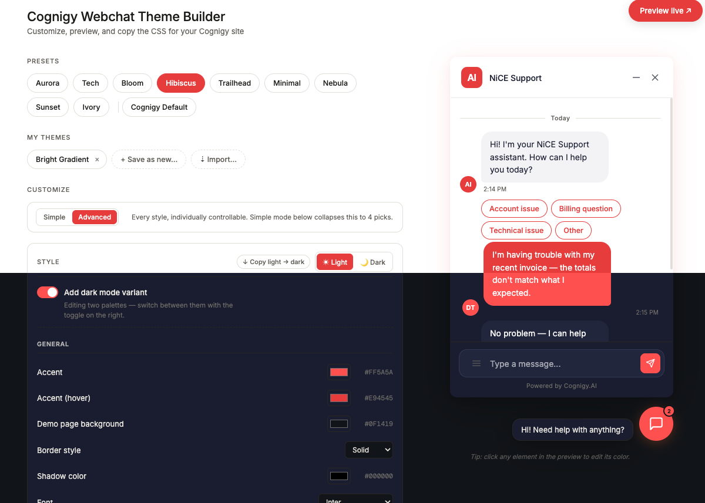

### Saved themes + JSON import/export

Save any theme you've built into "My Themes" with a custom name. Re-load with one click, edit and overwrite, or **import** shared themes via JSON paste. All saved locally in `localStorage`. Pair with the JSON tab in the Export panel to round-trip themes between machines or teammates without dragging CSS around.

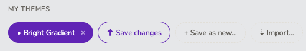

### Live Cognigy preview

Click **Preview live ↗** in the top-right to test your theme against a real Cognigy widget. The modal accepts either:

- **An endpoint URL** (preferred) - paste the URL passed to `initWebchat()` and the tool builds the standard Cognigy embed for you.
- **A full embed script** (advanced) - paste your two `<script>` tags directly, for custom embeds.

The widget loads in a sandboxed iframe with your theme CSS automatically injected. The iframe simulates a host page background, so the widget overlays exactly as it would on your real site.

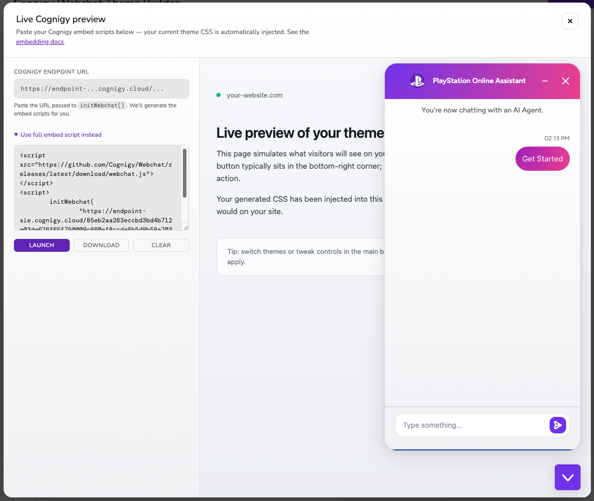

### Download a self-contained HTML preview

Inside the Preview Live modal, click **Download** to save the entire iframe contents as a single HTML file (`cognigy-preview-<preset>.html`). The file is fully self-contained: theme CSS baked in, Cognigy embed scripts included, ready to share with a client by email or upload to a static host.

### Click-to-edit

Hover any element in the right-side preview - header, bubbles, input field, FAB, badge - and a dashed outline appears. Click and the controls panel scrolls to that element's color picker and opens it. Useful for finding the right control without scrolling through the panel.

### Simple mode

Don't want to fiddle with 30+ controls? Switch to **Simple** and pick four things: a primary color, a surface color, a bubble style (Light or Dark bot bubble), and a shape (Rounded / Balanced / Sharp). The tool derives the rest. Switch back to Advanced any time to refine - Simple-mode picks are non-destructive when toggling.

### Organized control panel

In Advanced mode, the Style controls are grouped into subsections so finding the right knob is easier:

- **General** - accent, accent (hover), demo page background, font, shadow, border style
- **Window** - chat background, chat window border, container radius
- **Header** - background, text, divider line, alignment (left/center), button hover, header text size
- **Chat Bubbles** - bot + user bubbles (bg, text, border, gradient), bubble radius, message font size
- **Input Field** - input bg/text/border, input radius, input font size, send button + send button icon
- **Toggle** - chat button (FAB), unread badge, button radius

### Responsive widget sizing

The exported CSS wraps `width` and `height` in `min(...)` against the viewport, so the chat window stays usable on mobile and small desktop windows. Your slider value applies whenever there's room; on narrow viewports the widget shrinks to fit with comfortable margins.

### Other features

- **Gradient builder** on the chat background, header, and both bubbles. Two color stops, four direction options (↓ → ↘ ◉ radial), with a swap button.
- **Border styling** - color per element (chat header bottom, input, bot bubble, user bubble, chat window) plus a global style picker (None / Solid / Dashed / Dotted / Double).
- **Header alignment** - left (default) or center, matching Cognigy's stock centered layout when desired.
- **Decoupled send button** - `Send button` and `Send button icon` tokens override accent independently, so the button can be transparent / gray (Cognigy Default style) while the avatar and FAB stay accent-colored.
- **Optional hover bg** on the header minimize/close buttons - derived automatically from header text color in the preview, overridable per theme.
- **Granular typography** - separate font-size sliders for header, message bubble, and input field.
- **Shadow** - color picker + strength dropdown (None / Soft / Strong). Builds an `rgba()` shadow at the right opacity per strength.
- **12 fonts loaded** - DM Sans, Inter, Roboto, Open Sans, Source Sans 3, Poppins, Nunito, System UI, Helvetica, Georgia, DM Mono, JetBrains Mono.

## Presets

| Preset | Style | Light | Dark |
|---|---|---|---|
| **Aurora** *(default)* | Discord-inspired blurple on light/dark slate. Clean tech-app feel. | 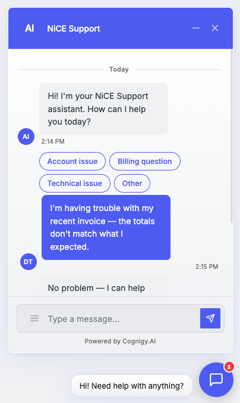 | 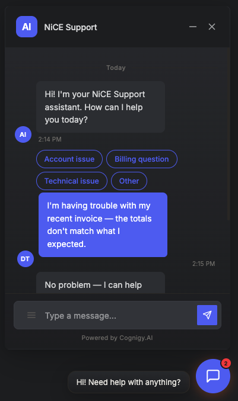 |
| **Tech** | Emerald on slate. Database/dev-tool aesthetic. | 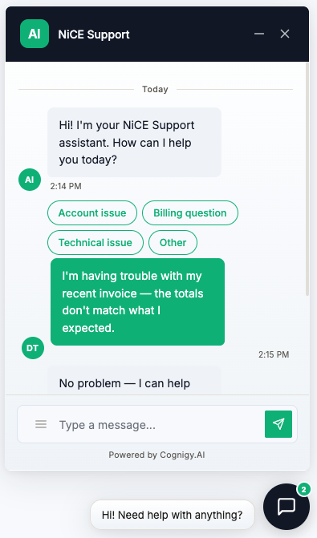 | 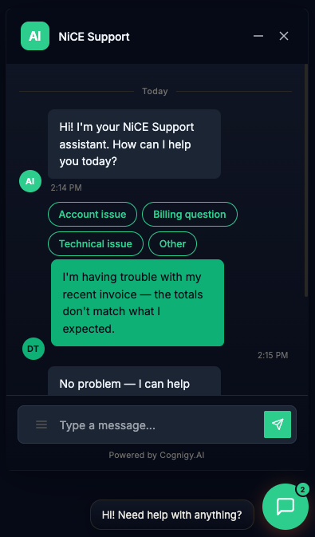 |
| **Bloom** | Vibrant violet + pink gradient bubbles. Friendly, lifestyle vibe. | 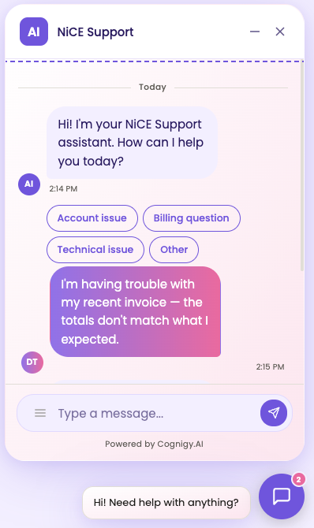 | 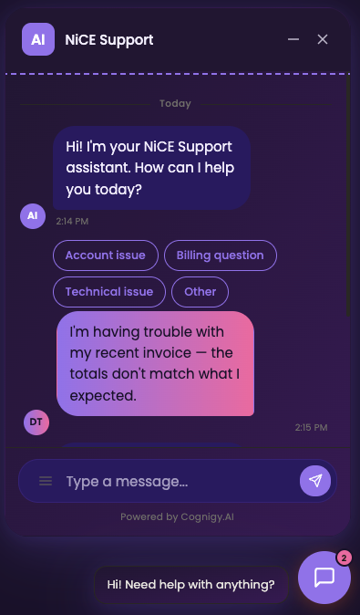 |
| **Hibiscus** | Coral red on white (light) or navy (dark). Editorial. | 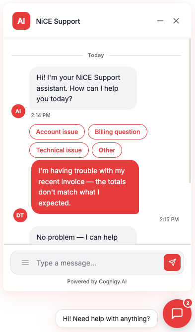 | 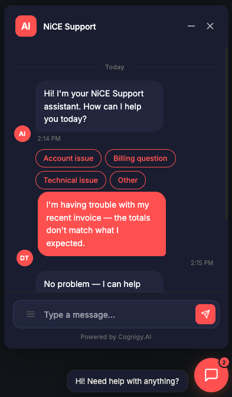 |
| **Trailhead** | Forest green + cream. Outdoor / utility brand feel. | 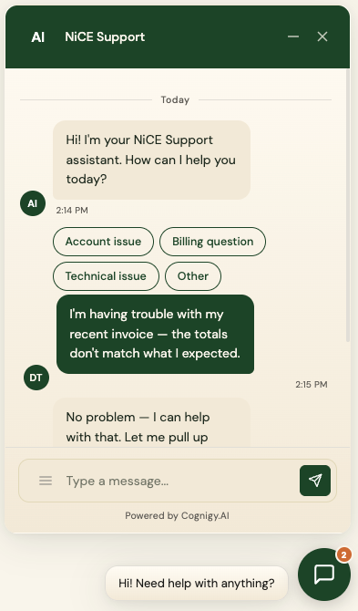 | 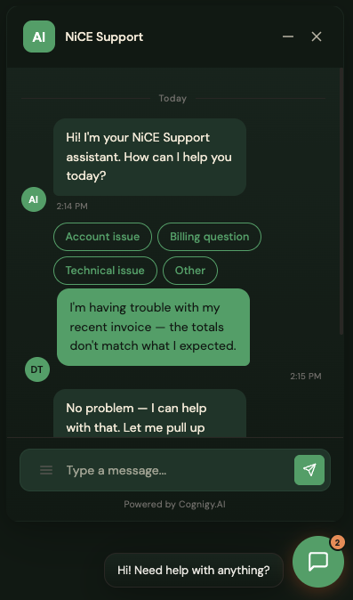 |
| **Minimal** | Mono palette, no gradients, sharp radii. Restraint. | 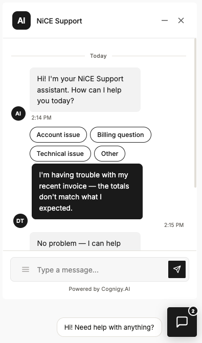 | 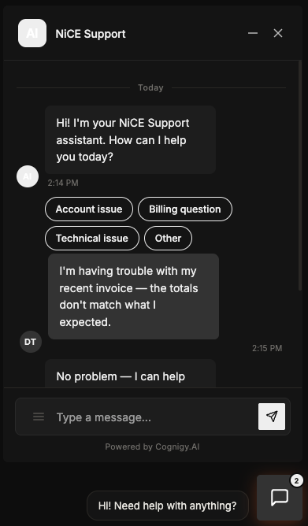 |
| **Nebula** | Radial purple→magenta gradients, dotted borders. Cosmic, expressive. | 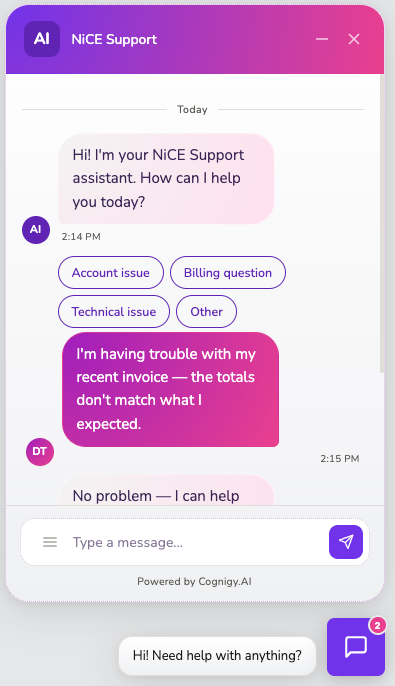 | 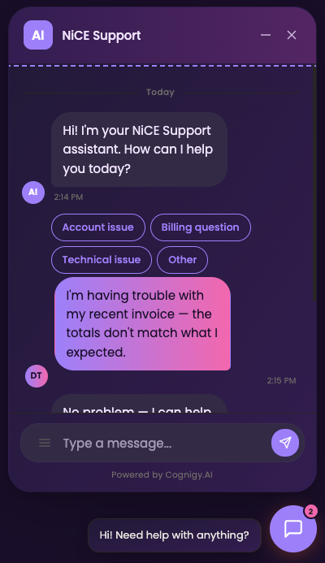 |
| **Sunset** | Warm orange→pink gradient header. Lifestyle warmth. | 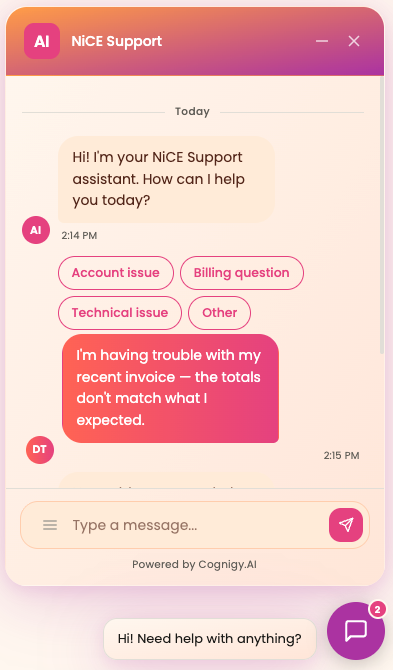 | 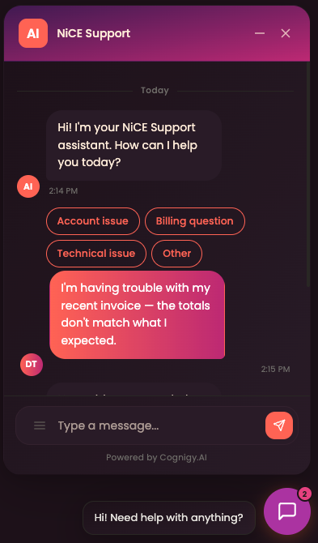 |
| **Ivory** | Cream + ink + champagne. Editorial luxury. | 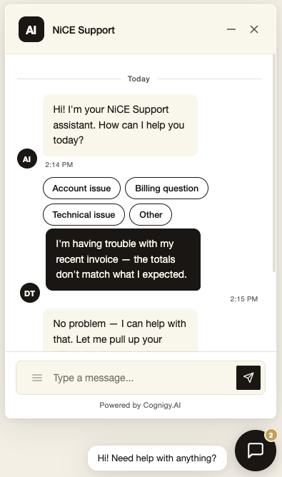 | 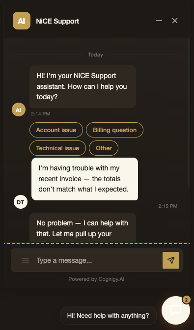 |
| **Cognigy Default** | Mimics the stock Cognigy widget - neutral white surfaces, blue accent, gray send button. The factory baseline for customization. | - | - |

All presets ship gradient-ready (off by default; flip on without re-picking colors). The **Cognigy Default** chip sits at the far right of the row with a small visual separator - it's a factory-reset starting point rather than a styled theme.

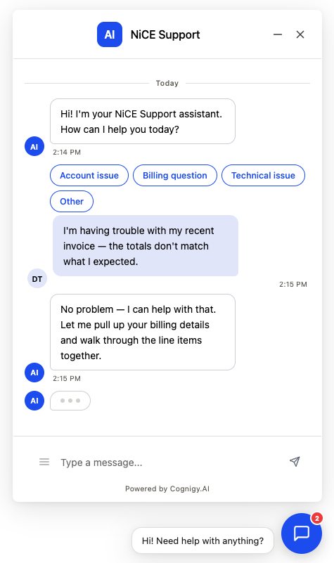

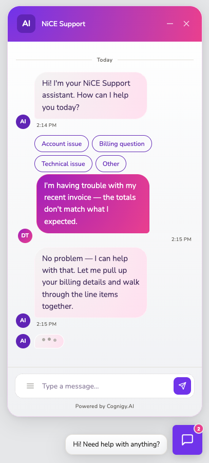

## Project layout

```
index.html         Standalone builder - open in a browser, no build needed
endpoint-embed.js  Built artifact: a Cognigy REST transformer that serves a
                   slimmed version of the builder. See "Hosting via a Cognigy
                   REST transformer" below. Regenerate with .build-embed.mjs.
.build-embed.mjs   Build script for endpoint-embed.js
README.md          This file - for users / contributors
CONFLUENCE.md      Internal documentation, written for non-developers
images/            Screenshots
```

The standalone builder is single-file by design - small enough that a build step would add more friction than value. The Cognigy embed is an optional secondary target with its own build script (described below).

## How it's wired

- The right-side preview is driven by CSS variables on `:root` and `[data-theme="dark"]`.
- Two `<style>` elements (`#light-overrides` and `#dark-overrides`) are populated by JS as you edit, overriding the defaults via source order.
- The snippet generator is independent of the preview: it maps each style to one or more `{ selector, property }` targets and emits concrete per-class rules with the Cognigy parent selectors prefixed.
- `transform` callbacks let styles read sibling values (used by `borderStyle` to compose the final `border` shorthand, and by `shadowStrength` to compose `box-shadow` from `shadowColor`).
- Subgroup rendering in the Style panel is driven by a `TOKEN_SUBGROUPS` map next to `renderControls` - tokens don't carry subgroup metadata, keeping the data model clean.

## Customizing further

To add a new style item, edit `TOKEN_DEFS` in [index.html](index.html):

```js
myNewItem: {
  label: 'My new item', type: 'color', group: 'Style',
  cssVar: '--my-new-var',                       // drives the in-page preview
  snippet: [                                    // drives the generated CSS
    { sel: `${SEL_ROOT} .some-cognigy-class`, prop: 'background-color' },
  ],
},
```

Then add a default value to each preset in `PRESETS`. If the control belongs to a specific subgroup (Header, Chat Bubbles, etc.), also add an entry to `TOKEN_SUBGROUPS` in the renderControls section. The control appears in the panel automatically.

## Hosting via a Cognigy REST transformer

If you want to serve the builder from inside Cognigy itself - for instance, to give internal teams a customizer at a Cognigy endpoint URL without standing up a static host - there's a build target for that: `endpoint-embed.js`.

It's a self-contained REST transformer that serves the entire builder (HTML + JS) from a single Cognigy endpoint. Paste it into a REST endpoint's transformer field and visit the endpoint URL in a browser.

### Build

```sh
node .build-embed.mjs
```

This reads `index.html`, strips a few features that can't run inside Cognigy's CSP (detailed below), minifies what's left, and writes `endpoint-embed.js` in the project root.

### Embedding

1. Run `node .build-embed.mjs` to produce `endpoint-embed.js`.
2. In Cognigy, create or edit a REST endpoint.
3. In the **Transformer** tab, paste the contents of `endpoint-embed.js` and save.
4. Visit the endpoint URL in a browser - the builder loads, with its JS bundle fetched as `<endpoint-url>?asset=js`.

The CSS export pastes into Cognigy webchat exactly as it does from the standalone version.

### Constraints - what the embed strips and why

Cognigy serves transformer responses under `Content-Security-Policy: script-src 'self'`, and the transformer code field has a payload size validator (~100 KB on most tenants). The build addresses both:

| Constraint | How the embed handles it |
|---|---|
| `script-src 'self'` blocks inline `<script>` | The single inline `<script>` block in the source is moved to an external bundle. The transformer routes `?asset=js` to the JS (same origin → `'self'` allows it) and bare requests to the HTML. |
| `script-src 'self'` blocks `onclick="…"` | The inline `onclick` handlers in the source were converted to `addEventListener` calls in `init()` - that change is in `index.html` itself, so both targets benefit. |
| Transformer field size limit (~100 KB) | The build drops **4 of the 10 presets** (Bloom, Trailhead, Minimal, Ivory) and the entire **Preview live ↗** feature. Final embed is ~90 KB. |

The Preview live feature is dropped because it can't function under CSP regardless of size: the preview iframe injects an inline `<script>initWebchat(...)</script>` into its `srcdoc` and pulls `webchat.js` from `github.com` - both are blocked by `'self'`.

The 6 surviving presets (Aurora, Tech, Hibiscus, Nebula, Sunset, Cognigy Default) and every customization control are preserved. Saved themes, JSON import/export, CSS/JSON export, dark mode, simple mode, and click-to-edit all work identically to the standalone build.

If your tenant's transformer size cap is tighter than ~100 KB, edit `.build-embed.mjs` to remove additional presets - each is ~2.5 KB.

## Related Cognigy tools

If you're building on the Cognigy stack, two other tools you might want to check out:

- **[CognigyODataSuite](https://github.com/danieltucker/CognigyODataSuite)** - OData query builder and inspector for working with Cognigy's data layer.
- **[CognigyCodeSandbox](https://github.com/danieltucker/CognigyCodeSandbox)** - Sandbox for prototyping Cognigy code-node JavaScript outside the editor.