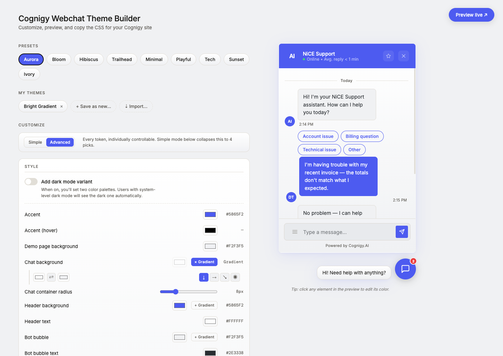
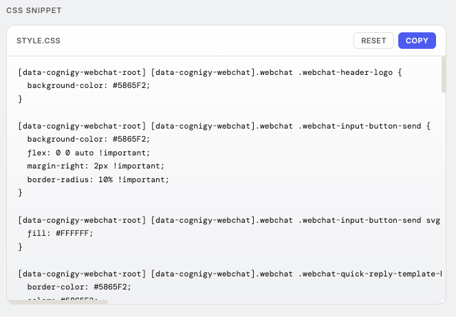
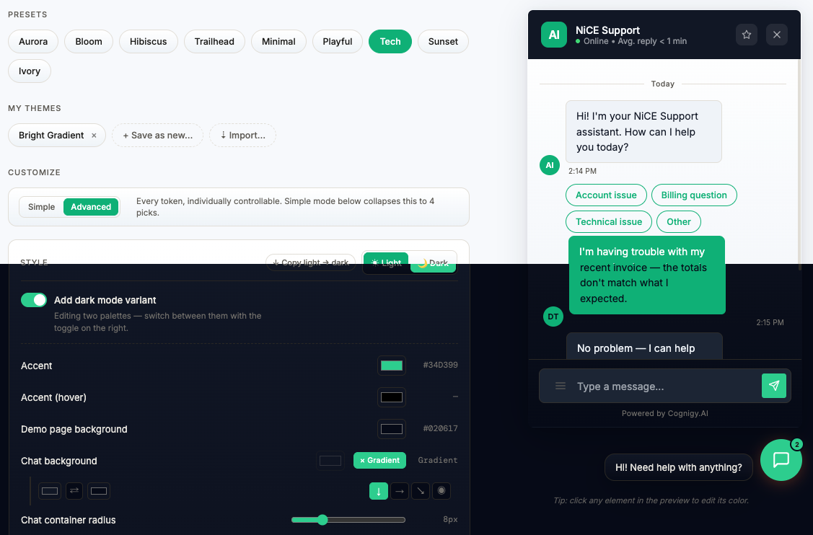
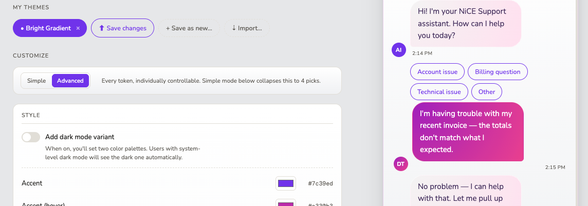

# Cognigy Webchat Theme Builder

A single-page tool for visually customizing the look of a Cognigy webchat widget and generating a copy/paste-ready CSS snippet to drop into your site.

Edit colors, gradients, typography, shape, borders, and shadows with live controls. Preview the widget in real time, optionally test it against a real Cognigy endpoint in a sandboxed live preview, then copy out a Cognigy-compatible stylesheet that includes both light and dark mode rules.



## Quick start

It's a single static HTML file — no build step, no dependencies.

```sh
open index.html
```

Or serve it from any static host. That's the whole setup.

## How to use it

1. **Pick a preset** from the chip row (Aurora, Bloom, Hibiscus, Trailhead, Minimal, Playful, Tech, Sunset, Ivory) or start from the default Aurora and tweak.
2. **Pick a mode** — Simple (4 high-level choices that derive ~20 styles) or Advanced (every style individually controllable).
3. **Adjust controls** — colors via picker, gradients via two-stop builder, radii and font sizes via slider, widget dimensions via slider, font and shadow strength via dropdown. The preview on the right and the generated CSS update instantly.
4. **Click any element in the preview** to jump straight to its style control.
5. **(Optional) Add a dark mode variant** with one toggle. Need to convert your light theme to dark? Hit "↓ Copy light → dark" and it auto-darkens via luminance inversion in one click.
6. **Pick an output mode** for the snippet: Light only, Dark only, or Both.
7. **Copy** the snippet and paste it into your Cognigy webchat custom CSS field — or paste your endpoint URL into the **Preview live ↗** modal to see it on a real widget first.

Your in-progress theme is autosaved to `localStorage`, so a refresh won't lose your work. **Reset** clears storage and reloads the Aurora preset.

## Features

### Live snippet generator

Every change updates the generated CSS in real time. Copy it out, paste it into Cognigy's custom CSS field, and you're done.



The snippet emits **per-class rules** wrapped in the Cognigy specificity selectors — not CSS variable assignments — because the Cognigy webchat's internal stylesheet doesn't reference these styles by name. Example:

```css
[data-cognigy-webchat-root] [data-cognigy-webchat].webchat .webchat-header-bar {
  background-color: #1C1B18;
}

@media (prefers-color-scheme: dark) {
  [data-cognigy-webchat-root] [data-cognigy-webchat].webchat .webchat-header-bar {
    background-color: #111110;
  }
}
```

When "Both" output mode is selected, dark mode is delivered via `@media (prefers-color-scheme: dark)` — **no JavaScript is required** on the host site. The browser switches automatically based on the user's OS preference.

Selectors are emitted with both v2 (`.regular-message`) and v3 (`.chat-bubble`) class names, so the same generated CSS works on any Cognigy webchat version.

### Light + dark mode editing

Dark mode is opt-in. Toggle "Add dark mode variant" on, and a second palette becomes editable. Switch between Light and Dark with the segmented control. Typography, shape, and sizing automatically mirror across both modes — only colors diverge.

The "↓ Copy light → dark" button takes your light palette and intelligently inverts luminance on backgrounds and text while preserving accent colors, giving you a usable dark theme in one click.



### Saved themes

Save any theme you've built into "My Themes" with a custom name. Re-load with one click, edit and overwrite, or import shared themes via JSON paste. All saved locally in `localStorage`.



### Live Cognigy preview

Click **Preview live ↗** in the top-right to test your theme against a real Cognigy widget. Paste your endpoint URL (or a full `<script>` block for custom embeds) and the widget loads in a sandboxed iframe with your theme CSS automatically injected. The iframe simulates a host page background, so the widget overlays just as it would on your real site.


### Click-to-edit

Hover any element in the right-side preview — header, bubbles, input field, FAB, badge — and a dashed outline appears. Click and the controls panel scrolls to that element's color picker and opens it. Useful for finding the right control without scrolling through the panel.

### Simple mode

Don't want to fiddle with 30+ controls? Switch to **Simple** and pick four things: a primary color, a surface color, a bubble style (Light or Dark bot bubble), and a shape (Rounded / Balanced / Sharp). The tool derives the rest. Switch back to Advanced any time to refine — Simple-mode picks are non-destructive when toggling.

### Other features

- **Gradient builder** on the chat background, header, and both bubbles. Two color stops, four direction options (↓ → ↘ ◉ radial), with a swap button.
- **Border styling** — color per element (input, bot bubble, user bubble, chat window) plus a global style picker (None / Solid / Dashed / Dotted / Double).
- **Granular typography** — separate font-size sliders for header, message bubble, and input field.
- **Shadow** — color picker + strength dropdown (None / Soft / Strong). Builds an `rgba()` shadow at the right opacity per strength.
- **12 fonts loaded** — DM Sans, Inter, Roboto, Open Sans, Source Sans 3, Poppins, Nunito, System UI, Helvetica, Georgia, DM Mono, JetBrains Mono.

## Presets

| Preset | Style |
|---|---|
| **Aurora** *(default)* | Discord-inspired blurple on light/dark slate. Clean tech-app feel. |
| **Bloom** | Vibrant violet + pink gradient bubbles. Friendly, lifestyle vibe. |
| **Hibiscus** | Coral red on white (light) or navy (dark). Editorial. |
| **Trailhead** | Forest green + cream. Outdoor / utility brand feel. |
| **Minimal** | Mono palette, no gradients, sharp radii. Restraint. |
| **Playful** | Purple/pink with rounded everything. Bold and friendly. |
| **Tech** | Emerald on slate. Database/dev-tool aesthetic. |
| **Sunset** | Warm orange→pink gradient header. Lifestyle warmth. |
| **Ivory** | Cream + ink + champagne. Editorial luxury. |

All presets ship gradient-ready (off by default; flip on without re-picking colors).

## Project layout

```
index.html      Everything: markup, styles, controls, generator, preview
README.md       This file
images/         README screenshots
```

Single file by design — small enough that a build step would add more friction than value.

## How it's wired

- The right-side preview is driven by CSS variables on `:root` and `[data-theme="dark"]`.
- Two `<style>` elements (`#light-overrides` and `#dark-overrides`) are populated by JS as you edit, overriding the defaults via source order.
- The snippet generator is independent of the preview: it maps each style to one or more `{ selector, property }` targets and emits concrete per-class rules with the Cognigy parent selectors prefixed.
- `transform` callbacks let styles read sibling values (used by `borderStyle` to compose the final `border` shorthand, and by `shadowStrength` to compose `box-shadow` from `shadowColor`).

## Customizing further

To add a new style item, edit `TOKEN_DEFS` in [index.html](index.html):

```js
myNewItem: {
  label: 'My new item', type: 'color', group: 'Style',
  cssVar: '--my-new-var',                       // drives the in-page preview
  snippet: [                                    // drives the generated CSS
    { sel: `${SEL_ROOT} .some-cognigy-class`, prop: 'background-color' },
  ],
},
```

Then add a default value to each preset in `PRESETS`. The control appears in the panel automatically.

## Related Cognigy tools

If you're building on the Cognigy stack, two other tools you might want to check out:

- **[CognigyODataSuite](https://github.com/danieltucker/CognigyODataSuite)** — OData query builder and inspector for working with Cognigy's data layer.
- **[CognigyCodeSandbox](https://github.com/danieltucker/CognigyCodeSandbox)** — Sandbox for prototyping Cognigy code-node JavaScript outside the editor.
